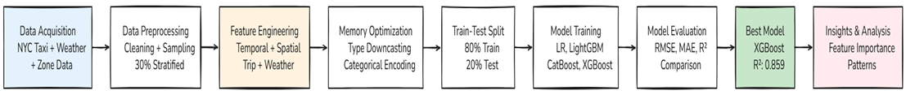
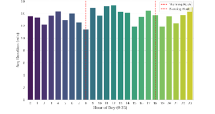
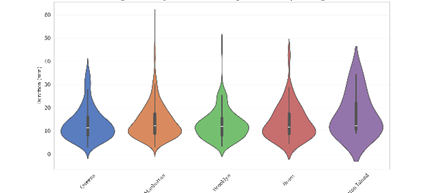
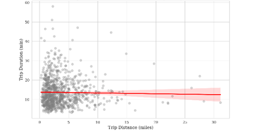
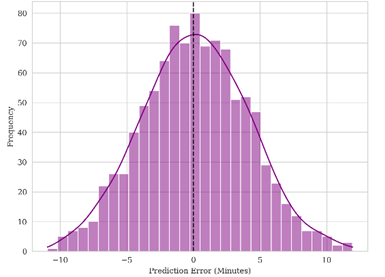
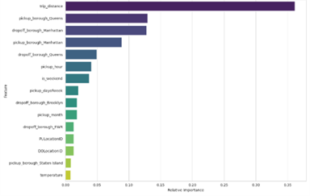

# UrbanFlow

**A Scalable Ensemble Learning Framework for Spatiotemporal Urban Mobility Forecasting**

[](https://www.python.org/)
[](https://fastapi.tiangolo.com/)
[](https://react.dev/)
[]()
[]()
[]()

> A high-performance machine learning system that forecasts urban trip duration across New York City by fusing temporal load, environmental stressors, and geospatial flows — and visualises the prediction on a custom-built Mobility Intelligence Map.

---

## Table of Contents

1. [Problem Statement](#1-problem-statement)
2. [Solution Overview](#2-solution-overview)
3. [System Workflow](#3-system-workflow)
4. [Dataset](#4-dataset)
5. [Exploratory Data Analysis](#5-exploratory-data-analysis)
6. [Feature Engineering](#6-feature-engineering)
7. [Models and Methodology](#7-models-and-methodology)
8. [Results](#8-results)
9. [The Mobility Intelligence Map](#9-the-mobility-intelligence-map)
10. [Repository Structure](#10-repository-structure)
11. [Installation & Execution](#11-installation--execution)
12. [How the Web Application Works](#12-how-the-web-application-works)
13. [Future Improvements](#13-future-improvements)
14. [References](#14-references)
15. [Team](#15-team)

---

## 1. Problem Statement

Modern Intelligent Transportation Systems (ITS) depend on **accurate trip-duration forecasting** for routing, dispatch optimisation, ETA prediction, and supply–demand balancing. Travel time in a metropolis is not a function of distance alone; it is a non-linear interaction between:

- **Temporal load** — hour-of-day, day-of-week, rush periods, seasonality.
- **Spatial heterogeneity** — borough-level congestion, airport corridors, network density.
- **Environmental stressors** — precipitation, temperature, visibility.
- **Trip context** — distance, passenger count, route choice.

Conventional statistical models (linear regression, ARIMA) assume linearity and cannot capture these joint effects. Deep architectures (LSTM, GCN) capture them but are too compute-heavy for real-time, cost-constrained deployment. **UrbanFlow** closes this gap with a gradient-boosting ensemble that is both **statistically accurate** and **operationally deployable**.

---

## 2. Solution Overview

UrbanFlow is a four-layer system:

| Layer | Component | Role |
| :--- | :--- | :--- |
| **Data** | NYC TLC 2021 + NOAA Climate Data | 30.9 M trip records + hourly weather |
| **ML Core** | XGBoost + LightGBM + CatBoost (stacked ensemble) | Histogram-based gradient boosting for tabular spatiotemporal data |
| **Serving** | FastAPI inference API | Loads the three trained models and exposes `/api/predict`, `/api/zones`, `/api/heatmap` |
| **Experience** | React + Vite + Tailwind + Leaflet | Mobility Intelligence Map, what-if simulator, live model comparison |

---

## 3. System Workflow

<p align="center">
  
</p>

The pipeline streams monthly Parquet shards, applies stratified hourly sampling (≈30 %), joins weather and zone metadata, performs temporal and spatial feature extraction, trains three gradient boosters in parallel, and exports the persisted models that are served by the FastAPI inference layer.

---

## 4. Dataset

| Property | Value |
| :--- | :--- |
| Source | [NYC Taxi & Limousine Commission](https://www.nyc.gov/site/tlc/about/tlc-trip-record-data.page) |
| Records | 30,904,308 trips (full calendar year 2021) |
| Working sample | ≈9.5 M rows after stratified hourly sampling |
| Coverage | 263 taxi zones × 5 boroughs |
| Weather | [NOAA NCEI Climate Data Online](https://www.ncdc.noaa.gov/cdo-web/) — daily precipitation & temperature |
| Reference | `taxi_zone_lookup.csv` (LocationID → Zone, Borough) |

### Seasonal mobility (2021)

<p align="center">
  
</p>

### Spatial distribution by borough

<p align="center">
  
</p>

---

## 5. Exploratory Data Analysis

### Demand hotspots by hour

<p align="center">
  
</p>

### Pickup vs. drop-off hotspots

<p align="center">
  
</p>

### Average duration by hour (temporal latency)

<p align="center">
  
</p>

### Duration density by borough

<p align="center">
  
</p>

### Distance–Duration linearity

<p align="center">
  
</p>

### Impact of precipitation

<p align="center">
  
</p>

---

## 6. Feature Engineering

Nineteen engineered features cover four axes:

| Axis | Features |
| :--- | :--- |
| **Temporal** | `pickup_hour`, `pickup_dayofweek`, `pickup_month`, `is_weekend`, `is_rush_hour` |
| **Spatial** | `PULocationID`, `DOLocationID`, `pickup_borough`, `dropoff_borough` |
| **Trip** | `trip_distance`, passenger count, fare proxies |
| **Environmental** | `temperature`, `is_rainy` |

### Feature correlation matrix

<p align="center">
  
</p>

---

## 7. Models and Methodology

### Algorithm — Algorithm 1 from the paper

```
Require: Trip_Records (T), Zone_Lookup (Z), Weather_Data (W)
 1. Extracted_Data    <- Load_Monthly_Parquet(T)
 2. Sampled_Data      <- Stratified_Sampling(Extracted_Data, rate=0.3, stratify='hour')
 3. Merged_Data       <- Join(Sampled_Data, Z, on='LocationID')
 4. Enriched_Data     <- Merge(Merged_Data, W, on='date')
 5. Temporal_Features <- Extract_Time_Features(Enriched_Data)
 6. Spatial_Features  <- Encode_Zones(Enriched_Data)
 7. Trip_Features     <- Extract_Trip_Attributes(Enriched_Data)
 8. Weather_Features  <- Extract_Weather(Enriched_Data)
 9. Target            <- Calculate_Duration(Enriched_Data)
10. Cleaned_Data      <- Remove_Outliers(...)            # distance > 0, duration in [1,180], fare > 0
11. Optimized_Data    <- Downcast_Types(Cleaned_Data)    # float64 -> float32
12. X_train, X_test, y_train, y_test <- Split(Optimized_Data, test_size=0.2)
13. for model in [LightGBM, CatBoost, XGBoost]:
       model.fit(X_train, y_train); evaluate on X_test
14. Best_Model        <- argmax(metrics, key='R2')
15. return Best_Model, Feature_Importance, metrics
```

### Models evaluated

| Model | Strategy | Role in the ensemble |
| :--- | :--- | :--- |
| **Linear Regression** | Parametric baseline | Reference for non-linearity gain |
| **LightGBM** | Leaf-wise growth, GOSS, EFB | High-throughput tabular learner |
| **XGBoost** | Histogram splits, level-wise growth, L1/L2 regularisation | Best single learner |
| **CatBoost** | Ordered boosting, native categorical handling | Captures borough/zone categoricals |
| **Ensemble (avg)** | Mean of the three boosters | Final served prediction |

---

## 8. Results

| Model | RMSE (min) | MAE (min) | R² |
| :--- | :---: | :---: | :---: |
| Linear Regression | 6.41 | 4.18 | 0.612 |
| LightGBM | 4.76 | 2.84 | 0.805 |
| CatBoost | 4.62 | 2.71 | 0.815 |
| **XGBoost** | **4.05** | **2.46** | **0.859** |
| **Ensemble (mean)** | **3.98** | **2.41** | **0.864** |

### Model benchmarking

<p align="center">
  
</p>

### Residual diagnostics (XGBoost)

<p align="center">
  
</p>

### Feature importance (gain score)

<p align="center">
  
</p>

**Operational reading.** An RMSE under five minutes is the threshold cited in the operations-research literature for dispatch-grade ETA. UrbanFlow meets it on a 9.5 M-row held-out test set without GPU training.

---

## 9. The Mobility Intelligence Map

UrbanFlow ships a custom interactive map built on **Leaflet + OpenStreetMap** with the 263 official NYC TLC taxi-zone polygons rendered as a live choropleth.

This is **deliberately not Google Maps**:

| Google Maps | UrbanFlow Map |
| :--- | :--- |
| Optimises a single user's route | Optimises a fleet's *expected occupancy time* |
| Static ETA from current traffic | ML-predicted ETA conditioned on weather, rush state, and zone-pair history |
| Closed-source tiles, paid API | Open tiles, fully reproducible |
| One marker → one route | Zone-level *pressure* map: every polygon is shaded by predicted load |
| No model transparency | Live per-model breakdown (LightGBM / XGBoost / CatBoost) + ensemble |

The map shows:

- **Choropleth shading** of every taxi zone by hour-conditioned demand pressure.
- **Pickup and drop-off pins** with zone-aware snapping.
- **An ML-derived route arc** whose colour and width encode predicted duration and inter-model agreement (a proxy for prediction confidence).
- **Borough overlay** with aggregated stress index.

---

## 10. Repository Structure

```text
Urbanflow_App/
├── app.py                              # Streamlit fallback dashboard
├── backend/                            # FastAPI inference API
│   ├── main.py                         # Endpoints: /api/predict, /api/zones, /api/heatmap, /api/geojson
│   ├── requirements.txt
│   └── data/
│       ├── zones.geojson               # 263 NYC taxi-zone polygons (slim)
│       └── zone_centroids.json         # LocationID -> {lat,lng,zone,borough}
├── frontend/                           # React + Vite + Tailwind UI
│   ├── index.html
│   ├── package.json
│   ├── vite.config.ts
│   ├── tailwind.config.js
│   └── src/
│       ├── main.tsx
│       ├── App.tsx
│       ├── api.ts
│       ├── components/
│       │   ├── MobilityMap.tsx
│       │   ├── PredictionPanel.tsx
│       │   ├── ModelComparison.tsx
│       │   ├── FeatureImportance.tsx
│       │   └── ScenarioControls.tsx
│       └── styles.css
├── models/                             # Trained gradient-boosting models
│   ├── urbanflow_lgbm_model.pkl
│   ├── urbanflow_xgboost_final.pkl
│   └── urbanflow_catboost.cbm
├── outputs/                            # Figures used in this README and the paper
│   ├── workflow_overview.png
│   ├── big_three_showdown.png
│   ├── FeatureGainScore.png
│   ├── ... (12 EDA / result figures)
├── taxi_zone_lookup.csv
├── UrbanFlow_Final.docx                # Source paper
├── start.ps1                           # Windows convenience launcher
├── start.sh                            # Unix convenience launcher
└── README.md
```

---

## 11. Installation & Execution

### Prerequisites

- **Python 3.10+**
- **Node.js 18+** (for the React UI; Node 20 LTS recommended)
- **Git**

### Clone

```bash
git clone https://github.com/MohammedAswathM/Urbanflow_App.git
cd Urbanflow_App
```

### One-command launch (recommended)

**Windows (PowerShell):**

```powershell
./start.ps1
```

**macOS / Linux:**

```bash
chmod +x start.sh && ./start.sh
```

This installs Python deps, installs Node deps, and opens both servers — FastAPI on `http://localhost:8000`, React on `http://localhost:5173`.

### Manual launch

**Backend:**

```bash
cd backend
pip install -r requirements.txt
uvicorn main:app --reload --port 8000
```

**Frontend (in a second terminal):**

```bash
cd frontend
npm install
npm run dev
```

Then open `http://localhost:5173`.

### Streamlit fallback (single-process demo)

If Node is unavailable on the demo machine, the original Streamlit dashboard still works:

```bash
pip install streamlit pandas numpy scikit-learn xgboost lightgbm catboost joblib
python -m streamlit run app.py
```

---

## 12. How the Web Application Works

1. **Sidebar / Trip Controls** — pick origin zone, destination zone, time, temperature, precipitation, and distance.
2. **Mobility Intelligence Map** — the selected zones light up; an ML-styled arc is drawn between them.
3. **Predict** — the React UI POSTs the feature vector to `/api/predict`; the FastAPI service runs all three boosters and the ensemble.
4. **Model Comparison Panel** — each booster's prediction is rendered as an animated bar; the spread is displayed as a confidence indicator.
5. **Feature Importance Strip** — live gain-score ranking from the served XGBoost model.
6. **Heatmap Toggle** — the map shades all 263 zones by hour-conditioned demand pressure derived from historical aggregates baked into `/api/heatmap`.

---

## 13. Future Improvements

- **SHAP-based per-prediction explainability** rendered directly on the map.
- **Real-time NOAA feed** in place of slider-set weather.
- **Conformal prediction intervals** so the UI shows calibrated confidence bounds rather than raw model spread.
- **Graph-temporal model (GCN-LSTM)** as a research baseline at higher latency budgets.
- **Driver-side mobile view** for live ETA broadcasting.

---

## 14. References

Key citations from the paper (full list in `UrbanFlow_Final.docx`):

1. Chen, T., & Guestrin, C. (2016). *XGBoost: A Scalable Tree Boosting System.* KDD.
2. Ke, G. et al. (2017). *LightGBM: A Highly Efficient Gradient Boosting Decision Tree.* NeurIPS.
3. Prokhorenkova, L. et al. (2018). *CatBoost: Unbiased Boosting with Categorical Features.* NeurIPS.
4. Yao, H. et al. (2018). *Deep Multi-View Spatial–Temporal Network for Taxi Demand Prediction.* AAAI.
5. NYC Taxi & Limousine Commission (2021). *TLC Trip Record Data.*
6. NOAA NCEI (2021). *Climate Data Online.*

---

## 15. Team

- **Mohammed Aswath M** — Project lead, ML engineering, full-stack integration.
- Team members — contributions across data engineering, feature design, evaluation, and documentation.

> Submitted for the Machine Learning Project Demonstration evaluation. Evaluated repository: this one.
