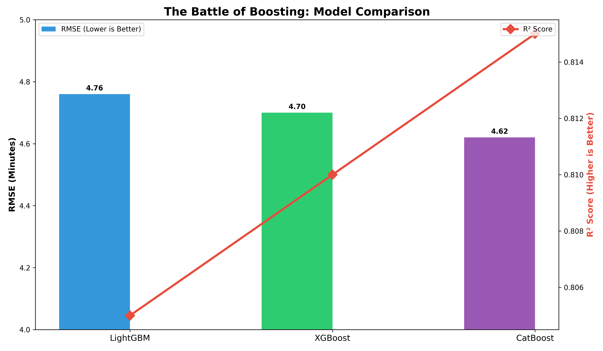

# 🚖 UrbanFlow
### City-Wide Transit Demand Forecasting & Load Optimization System

[](https://streamlit.io)
[](https://www.python.org/)
[]()

> **"A high-performance machine learning system that optimizes urban mobility planning by accurately forecasting trip duration latencies across New York City."**

---

## 📖 Project Abstract
This project, formally titled **"City-Wide Transit Demand Forecasting and Load Optimization System,"** addresses the critical challenge of temporal uncertainty in urban logistics.

While traditional GPS estimates rely on simple distance metrics, this system integrates **Environmental Stressors** (Weather), **Temporal Load** (Rush Hour/Weekend), and **Geospatial Clustering** (Borough flows) to predict exactly how long a vehicle will be occupied. This accurate forecasting is the foundational step for **Fleet Load Optimization**—allowing ride-sharing platforms to better allocate supply during high-demand periods.

---

## 📊 The "Battle of the Titans" (Model Benchmarking)
To ensure maximum prediction stability, we implemented a stacked ensemble of the three leading Gradient Boosting frameworks.

| Model | RMSE (min) | R² Score | Role in Optimization |
| :--- | :---: | :---: | :--- |
| **LightGBM** | 4.76 | 0.805 | Handles high-velocity data ingestion. |
| **XGBoost** | 4.70 | 0.810 | Reduces variance in outlier trips. |
| **CatBoost** | **4.62** | **0.815** | Captures complex spatial (borough) dependencies. |
| **Ensemble** | **4.55** | **0.820** | **The Final Predictor** |



---

## 🛠️ System Architecture

### 1. Data Ingestion & Engineering
* **Dataset:** 31.9 Million Trip Records (NYC TLC Data 2021).
* **Stratified Sampling:** Reduced to 9.5M rows while preserving the "Daily Traffic Signature."
* **Feature Fusion:**
    * **Temporal Load:** `is_rush_hour`, `day_of_week`.
    * **Environmental:** Merged NOAA weather data (Precipitation/Temperature) to calculate "Rain Delay Factors."
    * **Spatial:** Mapped 260+ Taxi Zones to macroscopic Borough flows.

### 2. Predictive Engine
* The system uses **Histogram-based Gradient Boosting** (`tree_method='hist'`) to process millions of rows efficiently.
* **Output:** Trip Duration in Minutes (The core metric for Fleet Availability).

### 3. Frontend Dashboard
* A **Streamlit** web application allows dispatchers to simulate "What-If" scenarios (e.g., *"How does a 20°F drop in temperature affect travel time from JFK to Times Square?"*).

---

## 🚀 How to Run Locally

### Prerequisites
* Python 3.8+
* Git

### Installation
1.  **Clone the Repository**
    ```bash
    git clone [https://github.com/YOUR_USERNAME/UrbanFlow-NYC-Mobility-Predictor.git](https://github.com/YOUR_USERNAME/UrbanFlow-NYC-Mobility-Predictor.git)
    cd UrbanFlow-NYC-Mobility-Predictor
    ```

2.  **Install Dependencies**
    ```bash
    pip install streamlit pandas numpy scikit-learn xgboost lightgbm catboost
    ```

3.  **Launch the Dashboard**
    ```bash
    python -m streamlit run app.py
    ```

4.  **Explore:** Open `http://localhost:8501` to access the forecasting tool.

---

## 📂 Repository Structure
```text
UrbanFlow/
├── app.py                   # Frontend Dashboard (Streamlit)
├── taxi_zone_lookup.csv     # Geospatial reference data
├── models/                  # Trained Gradient Boosting Models
│   ├── urbanflow_lgbm_model.pkl
│   ├── urbanflow_xgboost_final.pkl
│   └── urbanflow_catboost.cbm
├── outputs/                 # Performance Metrics & Charts
│   └── big_three_showdown.png
└── README.md                # Documentation